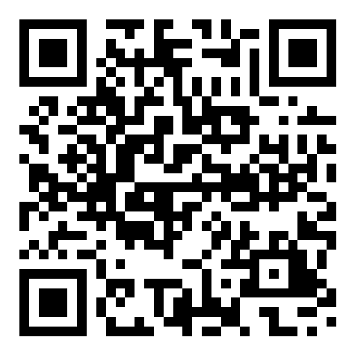
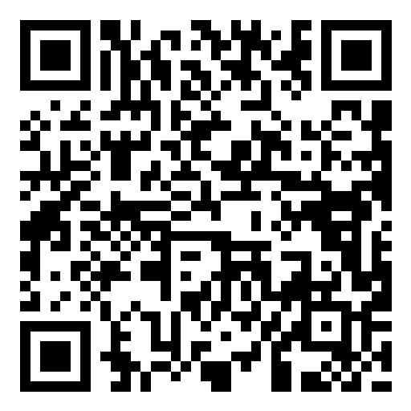
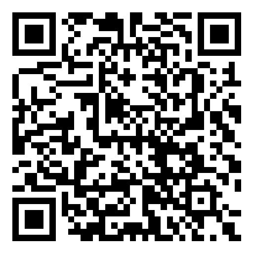

# vela-templates

Developer starters and connection recipes, separate from the app catalog.
`starters/` contains editable SDK consumers; `recipes/` documents connections to
existing software and contains no installation commands or executable hooks.

Run `../vela-create-app/cli.mjs` with a new app ID, target
directory and optional `hub`, `compact` or `seamless` view. The CLI copies a
starter and rewrites its manifest; it never installs dependencies or software.
The packed CLI includes these starters and works without the Vela repository.

```text
node ../vela-create-app/cli.mjs my-notes ./my-notes seamless
```

Import the generated directory through the Vela Library. App JavaScript uses
only `_vela/sdk.js`, never engine internals. The desktop/mobile browser contract
suite exercises all three view modes. This is a standalone repository in the Vela ecosystem.

## Shared app layout

Each starter ships `vela-app.css` and `vela-theme.js`. Together they give an app
the server's surfaces, spacing, controls and light/dark appearance without
sharing any host code, DOM or credentials — `vela-theme.js` only mirrors the one
theme string the bridge already sends onto `data-vela-theme`.

The stylesheet covers two shapes:

- A single work surface: `.vela-surface` with `.vela-surface-head`,
  `.vela-surface-body` and `.vela-surface-foot`, as the notebook starter uses.
- Navigation beside a work surface: wrap both in `.vela-layout` and add a
  `.vela-panel` with `.vela-panel-head`, `.vela-panel-search` and
  `.vela-panel-list`. Below 700px the panel becomes the first screen and the
  surface slides over it; give the surface a `.vela-back` control and add
  `.vela-surface-open` only when someone actually chose an item.
  [vela-notes](https://github.com/jhd3197/vela-notes) is the worked example.

Override `--vela-accent` (and its `-strong`/`-soft` companions) to keep your
app's identity inside the shared frame. Choose `hub` when you want the server's
rail and contextual header around your app; `compact` and `seamless` keep their
own chrome and are unchanged.

[Download starter archives](https://github.com/jhd3197/vela-templates/releases/latest).

## Contributing

See [CONTRIBUTING.md](CONTRIBUTING.md), [CHANGELOG.md](CHANGELOG.md),
[CONTRIBUTORS.md](CONTRIBUTORS.md) and [SECURITY.md](SECURITY.md).

## Support Vela

Vela is free and open source. If it saves you time, you can help keep it going:

- ⭐ [Star the repo](https://github.com/jhd3197/vela) — it costs nothing and helps a lot
- 💖 [GitHub Sponsors](https://github.com/sponsors/jhd3197)
- ☕ [Buy Me a Coffee](https://buymeacoffee.com/jhd3197)

### 💎 Crypto

| | Asset | Network | Address |
|:---:|---|---|---|
|  | **USDT** | **TRC-20** · Tron | `TTiCtqLauF1iSW2YGB3b78KmRxRqoLCgeL` |
|  | **USDT / ETH** | **ERC-20** · Ethereum | `0xD13D5355Fa214e8317fea2ff192a065BaeC13527` |
|  | **BTC** | **Bitcoin** | `bc1qatx67n3qxdvuv3arc9j8aytk34f22g02k9c7vr` |
|  | **SOL** | **Solana** | `AWXzqtBEgUfteHPQtDegsZ6D5y57M3GGdKPD8rR7h6xu` |

## License

[MIT](LICENSE). Created and maintained by [Juan Denis](https://github.com/jhd3197).
